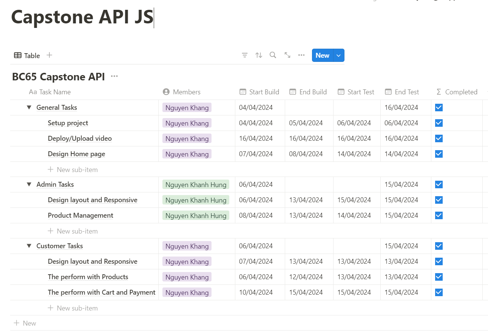

# 👋BC65 - Capstone API JavaScript

<strong>Table of Contents:</strong>

- [👋BC65 - Capstone API JavaScript](#bc65---capstone-api-javascript)
  - [About this project](#about-this-project)
  - [Technologies Used](#technologies-used)
  - [Demo](#demo)
  - [Authors](#authors)

---

## About this project

- Timeline project:
  

## Technologies Used

- List the main technologies and libraries/frameworks used
  - HTML, CSS
  - SASS/SCSS: [🔗sass-lang](https://sass-lang.com/)
  - Bootstrap: [v4.6](https://getbootstrap.com/docs/4.6/layout/overview/)
  - JavaScript
  - API: [🔗MockApi.io](https://mockapi.io/)

## Demo

- [Live Demo](https://ngkhang.github.io/bc65-capstone-api-js/)
- [Youtube](https://youtu.be/BEzJPfc7EG0)
- [Github](https://github.com/ngkhang/bc65-capstone-api-js)
- [Link Backup: Google Drive](https://drive.google.com/drive/folders/1mtfLlndP29VZUTqCSkYfAde_0T1hyjAS?usp=sharing)

---

## Authors

- 👤 **Nguyễn Khánh Hưng**: <khanhhung1234321@gmail.com>
- 👤 **Nguyễn Khang**: <ngkhang0220@gmail.com>
